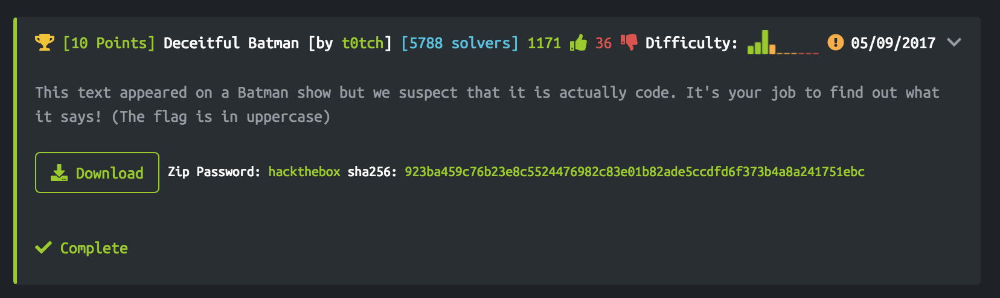

# DADA Final Project
## Hack The Box
### Zachary Anderson

---

## Get the Invitation Code

In order to obtain an account on Hack The Box, you need to generate an invitation code. This isn't just given to you; you start on this sign up page and need to figure out how to get one.

The first thing I did was open up the Firefox Developer Tools and look through the html. I remember one exploit from the web security week that involved altering the keys in the html to trick the database into letting you in. I couldn't get that to work, but while examining the html I saw a javascript file called iniviteapi.min.js.

I took a closer look at this file, still in the Developer Tools, and saw some things that looked like function names. One was called makeInviteCode.

I went to the console in the Developer Tools, and since this js file was already loaded in the browser, I run the makeInviteCode() function. It returned a BASE64 encoded string. I looked at the following site to learn about BASE64 endcoded strings: [1]. BASE64 encoded text looks like a jumbled mess of upper and lowercase letters, numbers, and either 0, 1, or 2 equals signs at the end. In many challenges these popped up and were readily recognizable.

I took the string and went to [2] and decoded it.

The message revealed that I needed to make a post request to one of the Hack The Box endpoints. I decided to use the curl command to make a simple post request. I got back another encoded string.

The format didn't specifically say it was BASE64 encoded, but it looked like it was a mix of upper and lowercase characters with an equals sign at the end. So I used the same website as before to decode the string.

I got back what looked like something that could be the invite code...so I tried it...

...and I got in!

I was able to make an account and start the challenges.

---

## Deceitful Batman [10 points]:

Looking through the challenges, they seemed pretty tough; so, I tried to find a simple one to ease my way into it. The first challenge was called Deceitful Batman. It is a 10 point Cryptography Challenge. You are given the instructions below and download a password protected zip file you open with 'hackthebox'. It contains a text file called finale.txt.

I opened finale.txt and saw it contained an encrypted string. The string only had two letters, so my first thought was that it was some binary representation. That didn't work out though, because there are 150 characters which doesn't divide evenly by 8. I also thought maybe it had something to do with morse code, but couldn't make sense of it that way either.

I was stumped, so I looked for how to decode strings with an unknown cipher and found a helpful website: [3]. One of the very first ciphers it mentions is a two symbol Cipher called Baconian. It says this is most likely the cipher being used in this situation.

I followed the link to the following page: [4]. Here I found that the Baconian cipher is in a class called substitution ciphers. It uses five letters to represent each letter you want to encode; in other words, five characters are substituted in for each character being encoded. Since the encrypted text only had two different symbols and the total number was divisible by 5, it looked promising. I found the key below for encoding and decoding. It was given on the website.

Treating the letter N as b and A as a in the key above, I translated the encrypted text to find that the flag is NAPIER.

So I entered HTB{NAPIER} into the Hack the Box challenge and completed it.

---

## Raining Blood [40 points]:

The next challenge I chose was a 40 point Steganography Challenge called Raining Blood. Steganography is hiding messages or files inside different types of messages or files. It sounded interesting, and had a cool name, so I tried it. It had the instructions below.

I downloaded the zip file and opened it with the password 'hackthebox'. It contained the mp3 file RainingBlood.mp3. I'm pretty sure I know this song from guitar hero.

The mp3 is a valid mp3 file. I clicked on it and it played the whole song.

I first checked what would happen if I changed the file extension to .txt. It spit out a ton of crazy looking characters, and was really long. I didn't feel like I was making much progress, so I tried for a better method.

In class, we did static analysis on a number of files using FileInsight. This had a nice GUI that let you view the readable strings of a file, and it helped if the contents were encrypted. During the Mobile Security week, we used the strings command to print out the readable characters from any file type which is like using FileInsight with the strings plugin. The linux man page for strings says that it prints out all the printable characters in a file [5]. This should get rid of a lot of the noise that I was seeing in the text file. Since I didn't have a hex editor already downloaded I decided to try the strings command first, so I ran 'strings RainingBlood.mp3' from the terminal. I didn't know exactly what I was looking for, but as I scrolled through the contents, one line stuck out from the rest and ended with two equals signs.

This looked to me like another BASE64 encoded string since from finding the invite code I learned that they could end in two equals signs. I went back to [2] and decoded it.

It turned out to be the hidden message. I went back to Hack the Box and entered the flag HTB{h1dd1ng_d4t4_b3tw33n_mp3_fr4m3s_is_not_funny!!} to complete the challenge.

After finishing the challenge, I was interested in how hard it was to see the encoded string in the text file I made. So, I went back and searched for the string, and saw how difficult it would be to find it without the strings command. It is well hidden among a lot of crazy looking symbols.

---

## fs0ciety [30 points]:

The next Challenge I chose was a 30 point Miscellaneous Challenge called fs0ciety. It involves cracking a password to a zip file and decoding an SSH password inside. The instructions and zip file are below.

Trying to open the zip file gives the following prompt.

I tried using the strings command again and sifted through the output. I couldn't find anything that could be used as the password. I searched online for ways to open a password protected zip file, and found several answers that involved using a program called John the Ripper [6]. It is a free tool that you can use to crack passwords of different file types using a variety of methods.

I downloaded the program from the website and compiled it for my OSX operating system. I then needed a large word list to test the hashed password against, so I found that the file rockyou.txt is very popular for password cracking [7]. I was having trouble getting it to run, so I looked for examples on youtube and found one [8]. It used a package you can download from homebrew called 'jumbo-john'. So I downloaded it and followed the tutorial with rockyou.txt as my wordlist. I managed to crack the password 'justdoit'.

Here is an explanation of the process in the screenshot below (I used the 'jumbo-john' repo for understanding the options I used running John The Ripper [9]):
* After downloading the jumbo-john via homebrew and adding john to my PATH, I used the zip2john command to get a copy of the hashed zip password, and saved it to a text file.
* I then ran john with the format option as PKZIP which tells john the type of hash to use (in this case for a zip file), and the wordlist as rockyou.txt. I also specified the text file with my hashed password to crack. This command runs through the massive word list and hashes each word and common differences to see if it matches the hashed password.
* I then ran john with the show option and my hashed password text file, and it displayed the resulting password.

Opening the zip file shows that there is a text file called 'sshcreds_datacenter.txt'.

The file contains encrypted SSH credentials.

It looked BASE64 encoded again so I used [2] to decode it.

It spit out binary, so I translated the binary to ascii characters to get the flag using [10].

I went back to Hack The Box and input the flag HTB{if_y0u_c@n_$m3ll_wh@t_th3_r0ck_is_c00king} to complete the challenge.

---

## Works Cited

#### [1] http://practicalcryptography.com/ciphers/base64-cipher/
#### [2] https://www.base64decode.org/
#### [3] http://practicalcryptography.com/cryptanalysis/text-characterisation/identifying-unknown-ciphers/
#### [4] http://practicalcryptography.com/ciphers/baconian-cipher/
#### [5] https://linux.die.net/man/1/strings
#### [6] https://security.stackexchange.com/questions/17774/how-to-recover-a-lost-zip-file-password
#### [7] https://synacl.wordpress.com/2012/08/18/decrypting-a-zip-using-john-the-ripper/
#### [8] https://www.youtube.com/watch?v=95ZKQsEx-8c
#### [9] https://github.com/magnumripper/JohnTheRipper
#### [10] http://roubaixinteractive.com/PlayGround/Binary_Conversion/Binary_To_Text.asp
