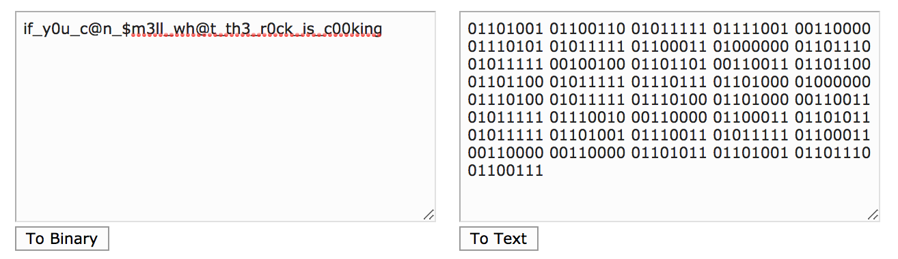

# DADA Final Project
## Hack The Box
### Zachary Anderson

---

## Get the Invitation Code

In order to obtain an account on Hack The Box, you need to generate an invitation code. This isn't just given to you; you start on this sign up page and need to figure out how to get one.

The first thing I did was open up the Firefox Developer Tools and look through the html. I remember one exploit from the web security week that involved altering the keys in the html to trick the database into letting you in. I couldn't get that to work, but while examining the html I saw a javascript file called iniviteapi.min.js.

I took a closer look at this file, still in the Developer Tools, and saw some things that looked like function names. One was called makeInviteCode.

I went to the console in the Developer Tools, and since this js file was already loaded in the browser, I run the makeInviteCode() function. It returned a BASE64 encoded string.

I took the string and went to https://www.base64decode.org/ and decoded it.

The message revealed that I needed to make a post request to one of the Hack The Box endpoints. I decided to use the curl command to make a simple post request. I got back another encoded string.

The format didn't specifically say it was BASE64 encoded, but it looked like it was since I've seen most of them end with an equals sign or two. So I used the same website as before to decode the string.

I got back what looked like something that could be the invite code...so I tried it...

...and I got in!

I was able to make an account and start the challenges.

---

## Deceitful Batman [10 points]:

Looking through the challenges, they seemed pretty tough; so, I tried to find a simple one to ease my way into it. The fist challenge was called Deceitful Batman. It is a 10 point Cryptography Challenge. You are given the instructions below and download a password protected zip file you open with 'hackthebox'. It contains a text file called finale.txt.

I opened finale.txt and saw it contained an encrypted string. The string only had two letters, so my first thought was that it was some binary representation. The didn't work out though, because there are 150 characters which doesn't divide evenly by 8.

I was stumped, so I looked for how to decode strings with an unknown cipher and found a helpful website: http://practicalcryptography.com/cryptanalysis/text-characterisation/identifying-unknown-ciphers/. One of the very first ciphers it mentions is a two symbol Cipher called Baconian.

I followed the link to the following page: http://practicalcryptography.com/ciphers/baconian-cipher/. Here I found that this cipher uses five letters to represent each letter you want to encode. It gave the key below for encoding and decoding.

Treating the letter N as b and A as a in the key above, I translated the encrypted text to find that the flag is NAPIER.

So I entered HTB{NAPIER} into the Hack the Box challenge and completed it.

## Raining Blood [40 points]:

## fs0ciety [30 points]:

